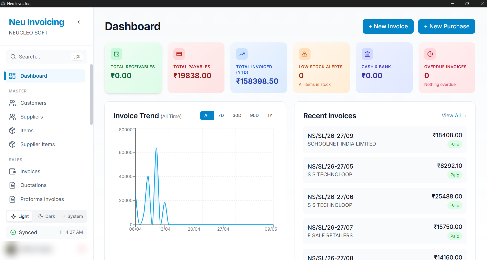
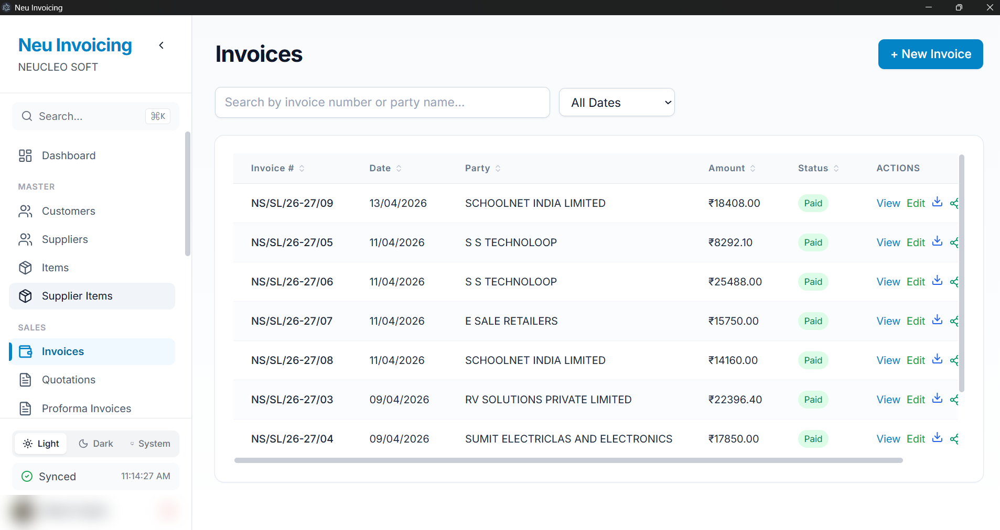
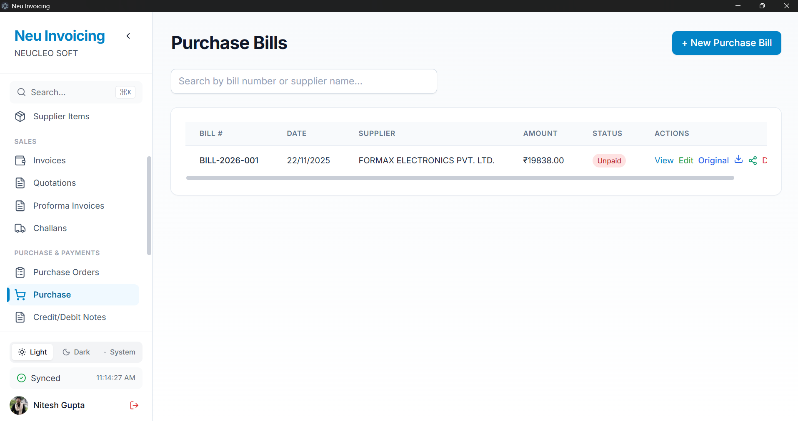
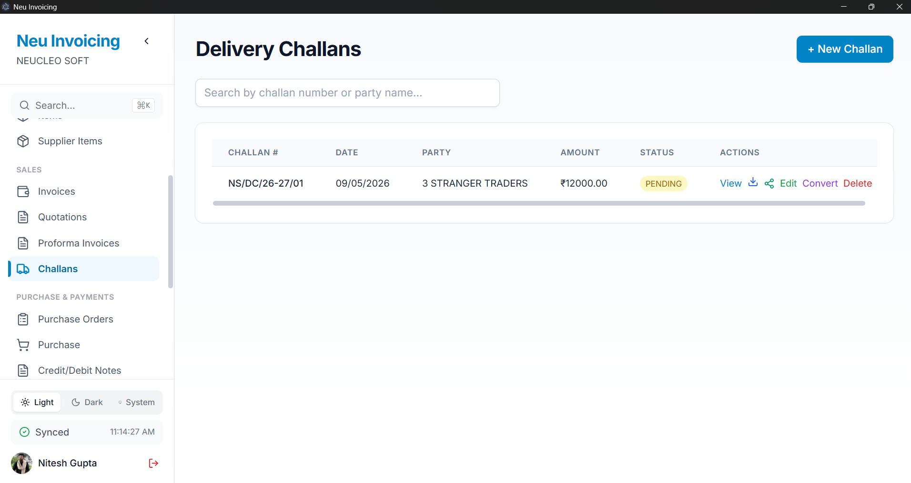
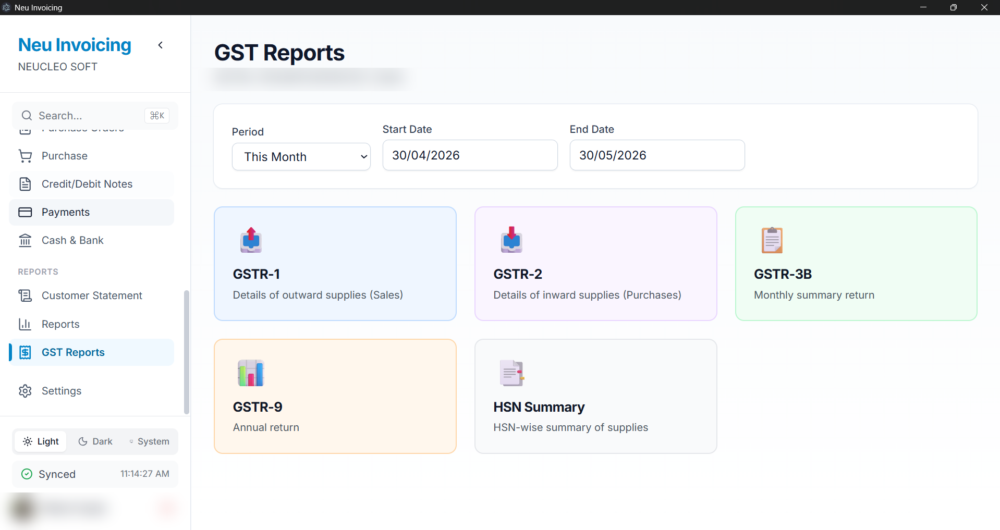
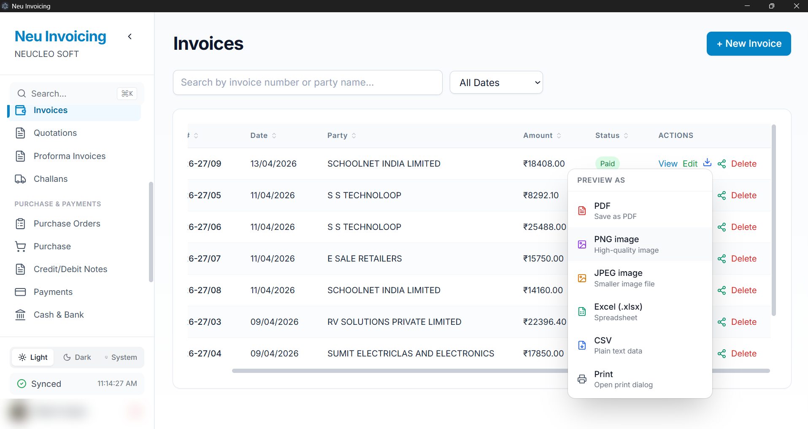
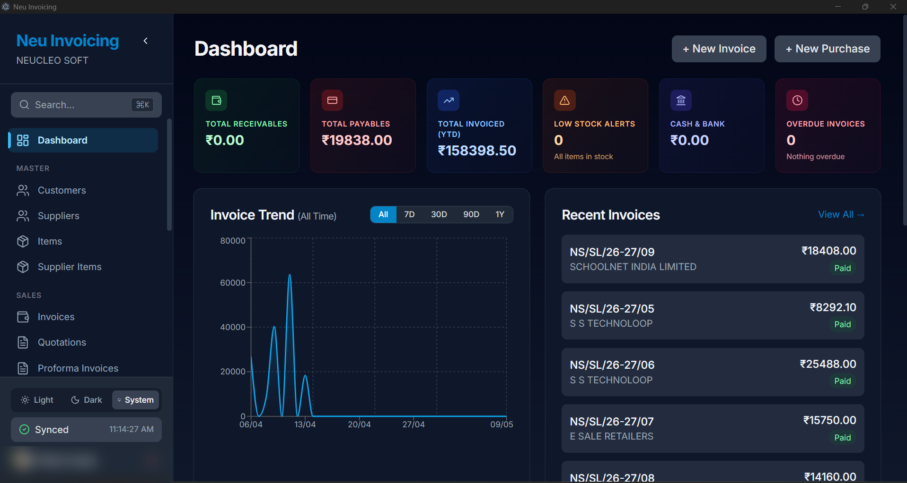
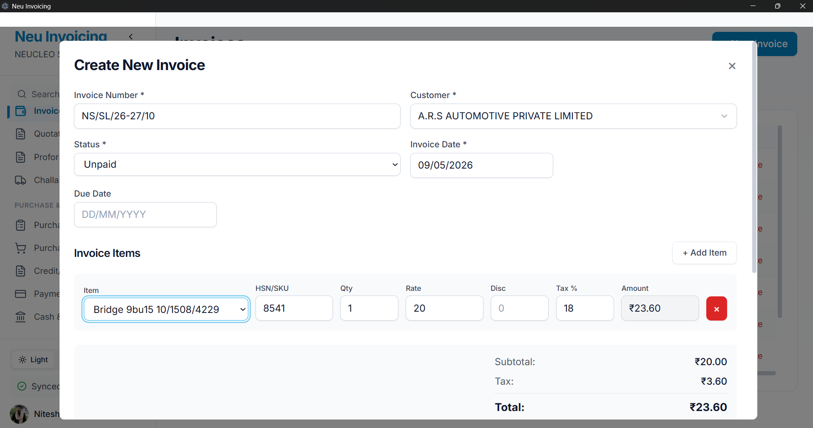
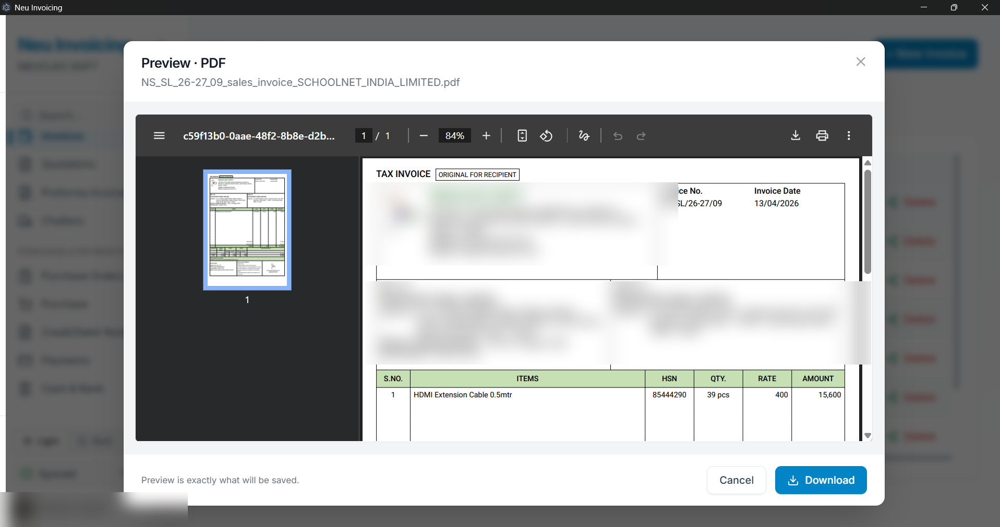

<div align="center">


# Neu Invoicing

**Offline-first GST invoicing that lives on your laptop and your phone — not someone else's server.**

Run your shop, your studio, your side hustle without paying a SaaS tax every month. Your data stays in a SQLite file you can copy, your backups go to *your* Google Drive, and the app works on the train.

[](https://github.com/neucleosoft/neu-invoicing/releases/latest)
[](https://github.com/neucleosoft/neu-invoicing/releases/latest)
[](https://github.com/neucleosoft/neu-invoicing/releases/latest)

[](LICENSE)
[](https://github.com/neucleosoft/neu-invoicing/releases/latest)
[](https://github.com/neucleosoft/neu-invoicing/stargazers)


</div>

---

## Why Neu Invoicing?

| 🛜 Works offline | 🔒 Your data, your drive | 🇮🇳 GST done right |
| --- | --- | --- |
| Cut power, kill Wi-Fi, board a flight — every screen still loads. | Your SQLite file syncs only to your own Google Drive `appDataFolder`. We don't have a server. | GSTR-1, GSTR-3B, HSN-wise summaries, GSTIN auto-validation, intra/inter-state CGST/SGST/IGST split — all out of the box. |

<br>

## ⚡ Quick Start (Non-Technical)

Three steps. No terminal, no Node, no Prisma.

<table>
<tr>
<td width="33%" align="center">

### 1. Download
[Grab the latest installer →](https://github.com/neucleosoft/neu-invoicing/releases/latest)

Pick **Windows**, **macOS**, or **Linux**.

</td>
<td width="33%" align="center">

### 2. Install
Double-click the installer.<br>
Approve the "untrusted publisher" prompt — we don't have a code-signing cert yet, the file is still safe.

</td>
<td width="33%" align="center">

### 3. Sign in
Click **Sign in with Google** the first time so your data can back up to your Drive.<br>
Done. Start invoicing.

</td>
</tr>
</table>

<br>

## ✨ What's inside

<details open>
<summary><b>📊 Dashboard</b> — receivables, payables, sales trend, low stock at a glance</summary>



Real-time tiles for receivables, payables, YTD sales, overdue invoices, and cash position. A sales trend chart that defaults to *all-time* with monthly bucketing once you cross a few months. Quick-action tiles drop you straight into "+ New Invoice", "+ Add Customer", etc. — no wasted clicks.

</details>

<details>
<summary><b>💰 Sales, Quotations &amp; Proforma</b> — pretty PDFs, multiple templates, GST-ready</summary>



Five invoice templates (Classic GST, Modern, Minimal, Elegant, Bold) rendered from the same shared blueprints on desktop and mobile — pick once in Settings and both devices print it. Quotations and proforma invoices convert to a real invoice in one click. Invoice numbers lock after issue (GST-safe), partial payments, and multi-rate tax handling.

</details>

<details>
<summary><b>🛒 Purchase + Purchase Orders</b> — extract bills from a photo, convert PO → bill</summary>



Upload a supplier's bill (image or PDF) and let the AI extract supplier, line items, HSN codes, and CGST/SGST/IGST split. Send a Purchase Order to a supplier as a styled PDF; convert it to a Purchase Bill the moment goods arrive.

</details>

<details>
<summary><b>🚚 Delivery Challans &amp; 📝 Credit/Debit Notes</b></summary>



Auto-numbered challans against parties with transport mode and vehicle number. Credit/debit notes link to invoices/bills and adjust the ledger automatically.

</details>

<details>
<summary><b>📈 Reports &amp; 🧾 GST</b> — GSTR-1, GSTR-3B, HSN summary, Excel export</summary>



Sales report, stock summary with valuation, outstanding receivables/payables, tax report, GSTR-1/2/3B/9 with per-section drill-downs, and HSN summaries for both sales and purchases. Exports to Excel/CSV — and GSTR-1 exports the **GST-portal JSON** your CA uploads to gst.gov.in directly, identical from desktop or phone.

</details>

<details>
<summary><b>📥 Multi-format Download</b> — PDF, PNG, JPEG, Excel, CSV, Print — with live preview</summary>



Every document has a **Download** icon that drops a fold-down menu of formats. Pick one and a preview opens — confirm to save. The Excel export is a single flat sheet you can pivot, sort, or paste into Tally.

</details>

<details>
<summary><b>👥 Parties, 📦 Items, 💳 Payments, 🏦 Cash &amp; Bank</b></summary>

Customer + supplier ledgers, statement view, item catalog with stock tracking and low-stock alerts, payment in/out across cash/bank/card/UPI/cheque, multi-account cash & bank. Bank balances are journal-backed (append-only entries, like a passbook) so they merge cleanly across devices and are always rebuildable.

</details>

<details>
<summary><b>📱 Mobile companion</b> — the full app on your phone, same brain</summary>

An Expo/React Native app with near-complete feature parity: every document type, payments, cash &amp; bank, reports, GST returns, PDF sharing with the same five templates, AI bill scan, and the same sync/backup/time-machine stack. Tax math, payment math, merge rules, and PDF blueprints are literally the same shared code the desktop runs — the two apps cannot drift on a number.

</details>

<details>
<summary><b>🩺 Data Health</b> — the books audit themselves</summary>

One tap rebuilds every balance, invoice status, stock count, and bank balance from the underlying documents and shows you any drift before fixing it. Checking changes nothing; fixing is explicit.

</details>

<br>

## 📸 Screenshots

<table>
<tr>
<td></td>
<td></td>
</tr>
<tr>
<td align="center"><sub>Dashboard — light</sub></td>
<td align="center"><sub>Dashboard — dark</sub></td>
</tr>
<tr>
<td></td>
<td></td>
</tr>
<tr>
<td align="center"><sub>Create an invoice</sub></td>
<td align="center"><sub>Generated PDF</sub></td>
</tr>
</table>

<br>

## 🔒 Where does my data go?

Short answer: **into a SQLite file on your device**, and into **your own Google Drive** (in a hidden app folder only this app can see). That's it.

- **Local:** `userData/neuinvoicing.db` — copy it, back it up, version it.
- **Cloud:** Google Drive `appDataFolder` scope. We literally cannot read it.
- **Sync model:** real two-device sync. Each device posts a small "diary" of its recent changes to your Drive and merges the other's — newest edit wins per document, invoice-number collisions auto-renumber with a receipt, a cancelled invoice stays cancelled everywhere, and a mass-deletion tripwire pauses and asks before applying 10+ removals. Use the desktop and the phone at the same time; totals are recomputed from the merged documents after every sync.
- **Backups:** a full-copy backup on your schedule, plus a three-rung **time machine** (daily / weekly / monthly copies kept deliberately stale, ~10 MB each) for mistakes you notice late. Every restore verifies its download before touching anything and parks your current database next to the new one — a wrong restore is one file-rename to undo.
- **Auth:** Google OAuth 2.0, refresh tokens on both apps — sign in once, works offline after.
- **No third-party servers.** No analytics. No phone-home.

<details>
<summary><b>Where is the local database file?</b></summary>

| OS | Path |
| --- | --- |
| Windows | `C:\Users\<you>\AppData\Roaming\neu-invoicing\neuinvoicing.db` |
| macOS | `~/Library/Application Support/neu-invoicing/neuinvoicing.db` |
| Linux | `~/.config/neu-invoicing/neuinvoicing.db` |

</details>

<br>

## 🛠️ For developers

<details>
<summary><b>Run from source</b></summary>

```bash
git clone https://github.com/neucleosoft/neu-invoicing.git
cd neu-invoicing
pnpm install

# Desktop
cd apps/desktop
cp .env.example .env        # fill in GOOGLE_CLIENT_ID / SECRET (see below)
pnpm prisma:generate
pnpm dev

# Mobile (Expo dev client)
cd apps/mobile
pnpm dev                    # then open the dev client on your phone
```

Architecture tour for contributors: [`docs/ARCHITECTURE.md`](docs/ARCHITECTURE.md). Schema-change recipe: [`MIGRATIONS.md`](MIGRATIONS.md).

</details>

<details>
<summary><b>Set up Google OAuth (one-time)</b></summary>

1. [Google Cloud Console](https://console.cloud.google.com/) → create a project.
2. Enable **Google Drive API**.
3. **Credentials → Create Credentials → OAuth 2.0 Client ID** → application type **Desktop app**.
4. Copy the Client ID + Client Secret into `.env`:
   ```env
   GOOGLE_CLIENT_ID=your-client-id
   GOOGLE_CLIENT_SECRET=your-client-secret
   REDIRECT_URI=http://localhost
   ```
5. Vite reads `.env` at build time and bakes the values into the main-process bundle — re-run `electron:dev` after editing `.env`.

</details>

<details>
<summary><b>Build platform installers</b></summary>

```bash
cd apps/desktop
pnpm build:win         # Windows NSIS .exe
pnpm build:mac         # macOS .dmg
pnpm build:linux       # Linux AppImage

cd apps/mobile
eas build --profile preview --platform android   # installable APK
```

Desktop output lands in `apps/desktop/release/`; EAS gives you a download link.

</details>

<details>
<summary><b>Tech stack</b></summary>

- **Monorepo:** pnpm workspaces — `apps/desktop`, `apps/mobile`, `packages/shared`
- **Desktop shell:** Electron (main + preload + renderer split), React + TypeScript + Tailwind + Zustand, SQLite via Prisma
- **Mobile:** Expo SDK 54 / React Native, expo-router, SQLite via Drizzle (same schema, hand-mirrored with Prisma's)
- **The shared brain (`packages/shared`):** GST engine, payment logic, recompute engine, sync merge rules, GSTN JSON builder, and every pdfmake document blueprint — imported by both apps so money math exists exactly once
- **PDF:** pdfmake everywhere (desktop renders directly; mobile runs pdfmake inside a hidden WebView) — all 5 invoice templates + every other document
- **Excel:** ExcelJS (desktop), CSV via share sheet (mobile)
- **AI extraction:** Gemini / OpenRouter for bill OCR (`OCR_PROVIDER` env var)
- **Build:** Vite + `vite-plugin-electron` + `electron-builder` (desktop); EAS (mobile)
- **Sync:** `googleapis` / Drive REST, `appDataFolder` scope only

</details>

<details>
<summary><b>Repo layout</b></summary>

```
neu_invoicing/
├── apps/
│   ├── desktop/
│   │   ├── electron/main/        # Node side: Prisma DB, OAuth, backups, row sync
│   │   │   ├── sync.ts           # Full backup + ladder + restore
│   │   │   ├── rowSync.ts        # Two-device diary sync
│   │   │   └── handlers/         # One file per domain (sales, purchase, …)
│   │   ├── src/pages/            # React renderer
│   │   └── prisma/schema.prisma
│   └── mobile/
│       ├── app/                  # expo-router screens
│       ├── sync/                 # Row sync, backups, ladder, purge (mobile twins)
│       └── drizzle/              # Generated migrations, bundled into the app
├── packages/shared/src/          # The shared brain (see docs/ARCHITECTURE.md)
│   ├── schema.ts                 # Drizzle schema (mirrors schema.prisma)
│   ├── gstCompute.ts             # The one GST implementation
│   ├── paymentLogic.ts           # applyPayment / reversePayment
│   ├── recompute.ts              # Rebuild every derived number
│   ├── syncPackets.ts + syncApply.ts   # Sync diary format + merge planner
│   └── pdf/                      # pdfmake blueprints, all docs + 5 templates
└── docs/                         # ARCHITECTURE.md + screenshots
```

</details>

<br>

## 🐛 Troubleshooting

<details>
<summary><b>Sync says "error" / I just signed in fresh</b></summary>

Settings → sign out → sign back in. The OAuth refresh token is regenerated and the app reconnects on the next sync tick. If it still fails, check that the OAuth consent screen for your project includes your email under "Test users" while in unverified mode.

</details>

<details>
<summary><b>"My data isn't there on the new device"</b></summary>

A **fresh device** gets its full history from the cloud backup, not from sync (sync diaries only carry the last 30 days of changes): sign in, and accept the restore offer that appears — on desktop it's the boot screen after a relaunch, on mobile it's the card on the company-setup screen. After that first restore, day-to-day changes flow through "Sync changes now" / auto-sync. If a *specific recent change* is missing, remember convergence takes one round trip: sync the device that made the change first, then the one that's missing it.

</details>

<details>
<summary><b>"AI extract from photo" fails</b></summary>

That feature needs `GEMINI_API_KEY` (or an OpenRouter key) in `.env`, and a *built* main bundle that includes it. After editing `.env`, re-run `npm run electron:dev` or rebuild — `.env` is baked at compile time, not read at runtime.

</details>

<br>

## 🗺️ Roadmap

**Shipped** — Mobile companion app (near-full parity) · Two-device sync with conflict resolution · Backup time machine (daily/weekly/monthly) · Undoable restores · Journal-backed bank balances · Data Health self-audit · 5 shared invoice templates · GSTR-1/2/3B/9 + GST-portal JSON export · PO ↔ Bill linking · AI bill extraction · Multi-format downloads · Dark mode (both apps)

**Next** — Logical-clock sync (clock-skew-proof) · Encrypted cloud backups · Email invoices in-app · Recurring invoices

**Later** — Multi-company · Roles + permissions · e-Invoicing (IRN) · Integrations (Tally, Zoho)

<br>

## 🤝 Contributing

Bug reports, feature ideas, and PRs are welcome — open an [issue](https://github.com/neucleosoft/neu-invoicing/issues) and let's chat first if it's a big change.

## 📄 License

[MIT](LICENSE) — use it for your business, fork it, ship it.

---

<div align="center">

**Built for small businesses who want to own their numbers.**<br>
<sub>Your data, your control, your business.</sub>

</div>
