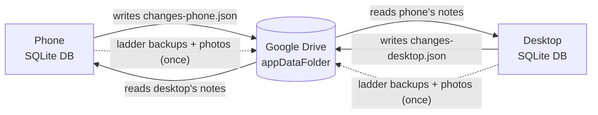
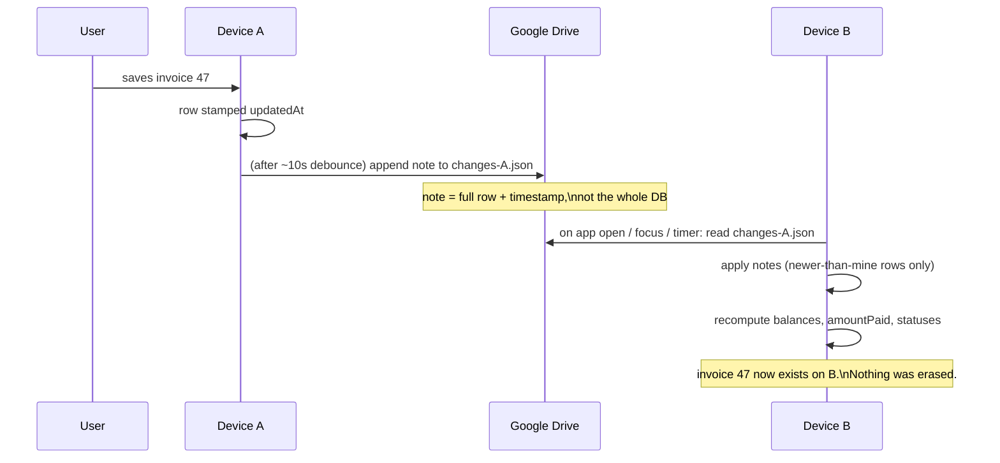
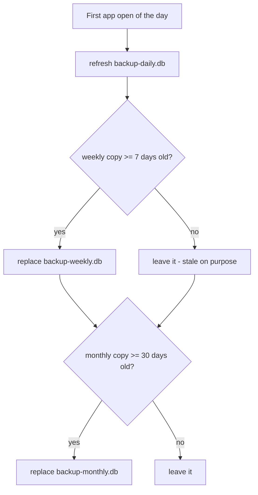

# Device Sync & Backup — Design

**Status:** FINAL (v1) — partly built · **Designed:** 2026-06-12 · **Code-audited + deletion model revised (trash → soft-delete):** 2026-06-13 · **Deletion model split (archive vs cancel/void), research-backed:** 2026-06-17 · **Cancel data-model = separate `cancelledAt` flag (research-backed), no Draft/no issuedAt (verified):** 2026-06-18 · **Mode B cancel SHIPPED (5 money docs) + cancel-with-credit-note (REVERSED) + status-derived-from-money + report-netting — all on BOTH apps:** 2026-06-19 · **Recompute engine BUILT + wired both apps (shared, dry-run/apply, proven on real DB):** 2026-06-22→07-11 · **Whole-system audit + fix wave (purchase parity, PaymentTransaction.updatedAt, atomic restores, firstSync guard) + S0 refresh token BUILT:** 2026-07-11 · **Owner:** Himanshu

neuInvoicing is offline-first with no server of our own. This document describes how
two devices (desktop + phone) on **one Google account** stay in sync and how backups
protect the data — using only the user's own Google Drive (appDataFolder) as the
relay and store. Zero hosting cost at any number of users, open-source friendly.

---

## 1. Goals & non-goals

**Goals**
- An invoice created on one device appears on the other automatically (foreground sync).
- Nothing is ever wiped wholesale by sync (today's whole-file backup/restore does exactly that).
- Backups survive disasters that are noticed late (week-old / month-old copies).
- Mass destruction cannot spread between devices without explicit consent.

**Non-goals (v1)**
- Multi-user (staff logins, roles) — needs a server someday; see Bitwarden model note at the end.
- Background sync while the app is closed (needs native background tasks → new build).
- Merging two unrelated databases (not needed: both devices share the same restored baseline — D9).

**Constraints (walls, not choices)**
- **C0 — zero cost to us, forever.** No servers, no paid tiers, no metered services, at any
  user count. Whatever scales with usage must be owned by the user (their Drive, their API
  keys). Consequences: `appDataFolder`/`drive.file` scopes only — the full-Drive scope
  requires a paid security audit · Android-first (Apple's yearly fee fails C0).
- Offline-first: the network only ever adds, never gates.
- One Google account = one business · plain SQLite files on both ends.

---

## 2. Zoom 1 — the map



**Rule that makes this safe:** each device only ever writes its **own** notes file.
Nobody writes to a shared file → no write conflicts at the Drive level, ever.

What lives in Drive:

| File(s) | What | Size | Refresh |
|---|---|---|---|
| `changes-<deviceId>.json` | that device's change-notes (diary) | KBs | constantly |
| `backup-daily.db` | full ledger, freshest | ~10 MB | every backup |
| `backup-weekly.db` | stale on purpose | ~10 MB | only if existing copy ≥ 7 days old |
| `backup-monthly.db` | very stale on purpose | ~10 MB | only if ≥ 30 days old |
| `img-<id>` (many) | one file per bill photo, immutable | ~290 MB total | uploaded once; deleted only when its bill is **purged** (~21 days after soft-delete) |

Photos are **split out** of the ledger backups: a photo never changes after capture,
so it needs exactly one copy ever — not a copy inside every backup. This also turns
the 300 MB-per-backup upload into a ~10 MB one.

---

## 3. Zoom 2 — the sync flow



**Apply rules (per DOCUMENT, not per row — corrected by 2026-06-13 audit):**
- A document syncs as ONE packet: its header row + all its line-items together. Line-items
  have **no stable id** (every edit deletes + reinserts them with fresh `cuid`s) and **no
  `updatedAt`**, so they can never be merged one-by-one — apply replaces the whole child set.
- Header missing locally → insert the whole packet.
- Header exists → compare header `updatedAt`, **newest edit wins** (whole packet — not per line).
- **Removal is just an edit** — *Archive* sets `deletedAt`, *Cancel* sets `cancelledAt`
  (two-tier model, see below) — so both ride this same newest-edit-wins path, no separate
  note type. Archive is reversible (clear `deletedAt`); Cancel is terminal.
- Totals (customer/supplier balance, invoice `amountPaid`/`balanceDue`/status, item stock) are
  **never synced — recomputed** from documents after applying. ✅ **This engine now EXISTS
  (built 2026-06-20→22, hardened 2026-07-11):** pure functions in
  `packages/shared/src/recompute.ts` (+ shared diff/report in `recomputeReport.ts`), wired into
  desktop (`electron/main/recompute.ts`, `pnpm run recompute` dry-run/apply) and mobile
  (`utils/recompute.ts`, Settings → Data Health). It nets active credit notes into balances,
  treats REVERSED as sticky, replays `stockMovement` over `item.openingStock`, and its rebuild
  has been proven equal to every live write path (25-case simulation + real-DB dry run,
  2026-07-11). ⚠️ Sync apply MUST run it only AFTER the boot-time `openingStock` backfill.

**Removal has two modes — Archive (soft-delete) and Cancel (void) — revised 2026-06-17.**
A hard delete can't sync (absence carries no message) and breaks anything pointing at the row,
so **nothing is ever physically removed on delete**. Both modes keep the row and flip a flag,
riding the same newest-edit-wins path. *Which* mode is decided by whether the row is **posted
financial data** (research-backed: this is GST-mandatory and what Tally / Zoho / QuickBooks /
Xero all do — see §10).

**Mode A — Archive (soft-delete + Restore).** For **master/reference data and non-binding
documents**: customers, suppliers, items, supplier-items, bank accounts, previous-invoice
archives, **quotations, proformas, purchase orders**. Delete **sets `deletedAt = now`** (a
nullable epoch-ms column) + bumps `updatedAt` — the "make inactive / archive" pattern. It is
**reversible**: an inline **Restore** clears `deletedAt`.
- **Sync trivial:** a one-field edit on the newest-edit-wins path. No tombstone, no special note.
- **Links never break / numbers self-reserve:** the row stays, FKs hold, the UNIQUE number can't
  be reused.
- **Visibility (2026-06-14):** stays **VISIBLE in lists** with a "Deleted" mark + inline Restore
  (no trash screen); **excluded from every number** (reports / dashboard / GST / balances /
  recompute / pickers) via the `notDeleted` helper. ~50 read sites mapped 2026-06-14.
- **Purge:** ~**21 days** after `deletedAt`, each device locally hard-deletes for real (and frees
  its Drive photo). Local, no sync needed — both devices share `deletedAt` and converge.
- *(Shipped 2026-06-15: all of Mode A across both apps.)*

**Mode B — Cancel (void, terminal).** For **posted financial documents**: sales invoices,
purchase bills, credit/debit notes, delivery challans, **and payments**. These can never be
deleted — only **Cancelled** — because GST law (CGST Rule 46(b)) requires invoice numbers to be
**consecutive with no gaps**, GSTR-1 reports the *count* of cancelled invoices, and an issued
document is part of the legal audit trail. Cancel:
- runs the **existing reversal** (puts stock & party balance back — the same delta logic the old
  hard-delete already did), then
- sets **`cancelledAt = now`** — a **separate nullable column, NOT a `status` value** (data-model
  decision 2026-06-18, see §10): cancellation and payment-progress are *different dimensions*, so a
  paid invoice keeps `status = PAID` and is shown "Cancelled" *derived* from `cancelledAt != null`.
  Plus an optional **`cancelReason`** (free text). `payment` — which has no `status` field at all —
  is cancelled by `cancelledAt` alone, uniformly with the other four,
- **keeps the document number reserved** — never reused, no gap,
- **excludes** the doc from every number (revenue, GST/turnover, balances, stock, pickers) via a
  `cancelledAt IS NULL` filter (parallel to `notDeleted`), while keeping it **visible, badged
  "Cancelled"**,
- is **terminal — there is NO Restore.** A mistake is fixed by issuing a fresh document, or a
  **credit note** (below),
- **for a PAID/part-paid invoice, Cancel becomes Cancel-with-Credit-Note** — it does NOT block
  (this **supersedes the old D12 "unlink payments first" plan**). See "Two cancel paths" below.

**No Draft concept today → every money doc is "issued" at birth (verified 2026-06-18).** The code
has no save-as-draft-without-effect state: the instant an invoice/bill is saved, its number is
assigned and its balance + stock effects commit, all in one transaction. So there is **no
never-issued draft to hard-delete** — *every* money-doc removal is a Cancel, and **no separate
`issuedAt` stamp is needed** (the row existing *is* "issued"). One related cleanup rides along: the
sales-invoice **status is a free dropdown today** (you can mark a *paid* invoice back to "Unpaid")
— it must be locked to payment-derived/read-only so it can never rewrite financial state.
*(If a true Draft stage is ever added later, drafts would get no number and be hard-deletable; the
ever-issued rule returns then.)*

**Invoice numbers are system-owned and immutable after save.** The number is **auto-assigned in
sequence at save/create time** (today there is no separate "issue" step), should be **read-only
per document** (today it's still an editable text field in several create/edit forms — to be
locked), and **frozen once cancelled**. Series / prefix / format / starting-number belong in
**Settings**, not on the document form, so a business migrating in sets a start point without ever
creating a gap or duplicate. *(NS-series numbering already auto-resets per Indian FY on 1 April.)*

**Two cancel paths — BUILT 2026-06-19, both apps (this is what shipped; supersedes D12's "block if
paid").** The trigger we wired is **whether money was received**, not filing-state (filing-state
isn't tracked yet — that's the deferred GSTR-1 work):
- **Unpaid money doc → plain Cancel.** Reverse stock + balance, set `cancelledAt`, hide everywhere
  (`notCancelled`). Terminal.
- **Paid / part-paid invoice → Cancel-with-Credit-Note.** Instead of blocking, it **auto-spawns a
  full credit note** (copies the invoice's line-items + stored GST split, `referenceInvoiceId` =
  the invoice), **reverses the whole sale** on the customer ledger by `totalAmount` (so cash already
  paid becomes a **negative balance = credit owed the customer**, to settle against a future bill),
  **restocks** (append-only reversing movement), and marks the invoice **`status='REVERSED'`,
  `balanceDue=0`**. A REVERSED invoice **STAYS VISIBLE** (it is NOT `cancelledAt`) so the gross
  invoice and its credit note sit side-by-side and **net to zero** in every report.

**`REVERSED` ≠ `Cancelled` (new state, sync-relevant).** Cancel hides via `cancelledAt`;
cancel-with-CN keeps the invoice gross-visible with `status='REVERSED'`, netted by its credit note.
Both are terminal — the edit screens refuse to edit a REVERSED *or* cancelled invoice. **Sync:** a
REVERSED invoice rides the normal header-edit path (`status` is just a column); its auto-credit-note
syncs as its own document packet; the two net via the generic report-netting — no special sync path.
The apply engine must treat **`REVERSED` as sticky, like `cancelledAt`** — a stale incoming edit
must never un-reverse it (extends the sticky-cancel rule, D14 / §7).

**Post-filing credit note (still future).** Once filing-state IS tracked (deferred GSTR-1 build), a
*filed* invoice — even if unpaid — will also be forced down the credit-note path (CGST §34), and
e-invoices past their 24-hour IRN window. Today the only wired trigger is "paid."

**Status is DERIVED from the money now — BUILT 2026-06-19 (D13 done).** The sales-invoice status is
no longer a free dropdown. The dropdown **drives** Amount Paid (Paid = full total, Partial = entered
+ validated 0<x<total, Unpaid/Overdue = 0; locked except Partial) and the **stored status is
computed** from amountPaid (`computePaymentStatus`), with `OVERDUE` preserved (due-date-derived at
read time) and `REVERSED` terminal. Editable on create AND edit; edit re-syncs the payment row. The
"mark a paid invoice back to Unpaid" loophole is closed. The up-front payment is now a **real, tagged
`PaymentTransaction` row** (`notes = 'Paid with invoice'`) on **both** apps — desktop previously
stamped only an `amountPaid` column with no ledger row (old such rows are backfilled lazily on edit
via a same-transaction `createdAt` match).

**Report-netting — BUILT 2026-06-19 (constrains the recompute engine).** Sales / tax / dashboard
"Total Sales" + chart now **net active credit notes** (CREDIT_NOTE subtracts, DEBIT_NOTE adds),
period-keyed by the note's **`noteDate`** (a June refund hits June — GST-correct), excluding
deleted + cancelled notes. A reversed sale + its auto-CN therefore net to zero automatically. **The
S2 recompute engine must do the same** — any sales/turnover figure it rebuilds nets active credit
notes; receivables/ledgers already reflect CNs via `currentBalance`/`balanceDue` and must NOT be
double-netted. The **formal GST returns** (GSTR-1/3B/9) are deliberately left **gross** for now —
proper CDNR-section routing is the deferred GSTR-1 build (**spec'd in `docs/gst-design.md`**).

**Sync doesn't care which mode:** both `deletedAt` and `cancelledAt` are ordinary nullable-column
edits, so both ride the same newest-edit-wins packet path. Cancel is even simpler than archive
(one-way — no restore races).

---

## 4. Zoom 2 — the backup ladder & tripwire



Why stale-on-purpose: a disaster noticed two weeks late has already poisoned every
*fresh* copy. The week-old and month-old rungs are the time machine.

**Tripwire:** when incoming notes flip **10 or more rows** to `deletedAt` at once, the
receiving device pauses and asks — *Apply / Don't apply / Restore from backup* — before
applying. Destruction never spreads silently. (An uninstalled/cleared device writes **no**
notes at all, so it deletes nothing remotely — it just re-seeds itself from Drive.)

**Defense in depth:** the **tripwire** prevents, the **`deletedAt` flag** is itself the undo
(recoverable until the 21-day purge), the **ladder** time-travels. Three independent layers
between a mistake and real loss.

---

## 5. Zoom 3 — a change-note

```json
{
  "v": 1,
  "device": "a3f9…",
  "table": "salesInvoice",
  "rowId": "ckx…",
  "deletedAt": null,
  "updatedAt": 1781068977720,
  "row": { "…header columns…": "…", "attachmentRef": "img-ckx…" },
  "children": { "salesInvoiceItem": [ { "…line 1…": "…" }, { "…line 2…": "…" } ] }
}
```

- A note carries the **whole document family** — the header in `row`, every line-item in
  `children` — because line-items can't be reconciled individually (§3). Apply = upsert header
  + replace all children.
- `deletedAt` (archive) and `cancelledAt` (cancel) are just columns inside `row`, so a
  delete, restore, or cancel is an ordinary note — the engine treats it like any edit, no special path.
- `updatedAt` is an **epoch-millisecond integer** (matches Prisma's storage and the mobile
  `prismaDate` type fixed 2026-06-13), NOT ISO text.
- `v` — format version. A device receiving notes with a newer `v` than it understands
  shows "update the app to keep syncing" instead of guessing.
- Photos are **referenced** (`img-<id>` on Drive), never embedded.
- Applying is idempotent — re-reading the same notes is harmless.

---

## 6. Decisions (and why)

| # | Decision | Why |
|---|---|---|
| D1 | User's own Drive as relay — no server | Free at any scale; open-source friendly; same pattern WhatsApp uses for backups |
| D2 | Per-row newest-edit-wins (not per-file) | Today's whole-file sync throws away an entire device's work; per-row limits any loss to a single doubly-edited row |
| D3 | Totals recomputed, never synced — **engine BUILT (2026-06-22, hardened 2026-07-11)**: shared `recompute.ts`/`recomputeReport.ts`, wired both apps, proven against the real DB | Counters can't merge; documents can. The 2026-06-13 audit's "does not exist" is resolved; what remains is calling `recomputeAll({apply:true})` as the last step of sync apply (after the openingStock backfill) |
| D4 | One shared invoice series; on collision the **later-created** invoice is renumbered to the next free number + logged | User preference (rejected per-device series). Caveat: an already-shared PDF carries a dead number → re-send it |
| D5 | Conflicts resolve quietly + a **Sync activity** log in Settings | No popup fatigue; full receipts for every conflict/renumber/tripwire event |
| D6 | Tripwire at **10+ removals** (archives or cancels) | Small cleanups flow freely; mass destruction asks first |
| D7 | Ladder = daily / weekly / monthly (3 copies) | Covers instant and slowly-discovered disasters at ~2–4 % of a 15 GB Drive |
| D8 | Photos stored once, outside ledger backups | Immutable data needs one copy, not one per backup; backups drop from 300 MB to ~10 MB |
| D9 | First-sync: no merge needed — both devices already run the same restored DB baseline; one-time catch-up notes for rows with `updatedAt` after the last restore | Decided 2026-06-12. The backup/restore feature accidentally solved seeding: restore made the databases identical |
| D10 | **Two-tier removal (R8, split 2026-06-17).** *Archive* — soft-delete `deletedAt`, reversible, 21-day purge — for master data + quotations/proformas/POs (shipped 2026-06-15). *Cancel* — terminal `cancelledAt` flag (separate from `status`), number kept, optional reason, **no Restore** — for posted money docs (invoice/bill/credit-note/challan/payment). Both stay visible (marked), excluded from reports/GST/balances/pickers | GST Rule 46 forbids number gaps + GSTR-1 reports cancelled invoices ⇒ issued financial docs can't be deleted, only voided; master data is fine to archive/restore. Matches Tally/Zoho/QuickBooks/Xero. Both modes are just column edits → one sync path |
| D11 | Each device trims its **own** diary of entries older than **30 days**; a device offline longer re-seeds from `backup-daily` and syncs forward | Diaries can't grow forever; the ladder covers the trim's blind spot — two pieces guarding each other |
| D12 | **Cancel reverses then voids:** runs the existing stock/balance reversal, sets a separate `cancelledAt` (+ optional `cancelReason`; leaves `status` untouched), keeps the number, excludes from all numbers. ~~Blocked while paid — unlink first.~~ **SUPERSEDED 2026-06-19 → see D15:** a *paid* invoice is NOT blocked; it reverses via **Cancel-with-Credit-Note** | Mirrors QuickBooks/Xero void. The block-if-paid plan was replaced by the credit-note reversal the pros actually use (research §10) |
| D13 | **No Draft today → every money-doc removal is Cancel** (verified 2026-06-18): saving an invoice assigns its number + commits balance/stock atomically — no draft to hard-delete, no `issuedAt` stamp. **status-dropdown lock DONE 2026-06-19** (status now derived from amountPaid, see D15). Invoice-number lock (read-only per doc; series in Settings) still pending | Guarantees Rule 46 consecutive numbering; closes the paid→draft status loophole |
| D14 | **Cancel = a separate `cancelledAt` timestamp, NOT a `status` value** (2026-06-18, research §10): cancellation and payment-progress are different dimensions, so a paid invoice keeps `status=PAID`; display shows "Cancelled" derived from `cancelledAt != null`; filter = `cancelledAt IS NULL` (parallel to `notDeleted`); `payment` (no status field) is cancelled by `cancelledAt` alone | Overwriting `status` would erase payment history and can't represent a cancelled payment. Matches Shopify/Crater/ERPNext multi-axis design |
| D15 | **Cancel-with-Credit-Note + `REVERSED` + status-derived + report-netting — BUILT 2026-06-19, both apps.** A *paid* invoice reverses by auto-spawning a full credit note and marking the invoice `status='REVERSED', balanceDue=0` (stays VISIBLE, netted by its CN) — not blocked (supersedes D12). Status is derived from amountPaid (OVERDUE preserved, REVERSED sticky/terminal); the up-front payment is a real tagged `PaymentTransaction` row. Sales/tax/dashboard reports net active credit notes by `noteDate` | It's how Vyapar/myBillBook/QuickBooks/Xero actually reverse a *paid* sale (research §10) — keeps the GST audit trail (invoice + offsetting CN both stand) and the books honest. **Sync impact:** REVERSED is sticky like cancelled; the auto-CN is its own document packet; the recompute engine must net active CNs |

**Stated defaults (veto-able):** settings/API keys/theme never sync · sync is
foreground-only · push debounced ~10 s · desktop pull timer ~5 min · photos
downloaded lazily on first view.

---

## 7. Edge cases

| Case | Handling |
|---|---|
| Same row edited on both devices | Newest wins + activity-log entry |
| Edited on A, archived on B | Newest action wins, logged |
| Cancelled / Reversed on A, edited on B (stale, offline) | **Cancel AND Reverse are sticky** — both win regardless of timestamp; a later edit can't resurrect a cancelled doc nor un-reverse a `REVERSED` invoice |
| Both devices sell the last unit | Stock goes negative (matches current behavior), never blocks |
| Cash/bank adjusted on both | Newest wins; other adjustment lost — **v1 limitation** (journals later) |
| Device clock wrong | Drive's response time used as sanity check → "your clock looks wrong" warning |
| Drive full | Sync pauses with banner; app fully usable locally |
| Google session expires | Refresh-token renewal (see §8 step 0); on hard failure: "sign in again" banner |
| Older app receives newer notes | Version gate → "update the app" |
| App uninstalled / data cleared | No notes written → nothing spreads; reinstall re-seeds from Drive |
| Restore from a ladder copy | Device adopts restored state, baseline resets, re-syncs forward |
| Restore an archived doc whose parent is also archived | Parent row still exists (just flagged) so the link holds; offer to un-delete the parent too (Mode A only — money docs can't be restored) |
| New doc wants a number a removed one used | Can't happen — an archived *or* cancelled row keeps its number and the UNIQUE constraint blocks reuse |
| Cancel an invoice that has payments | **Reverses via a credit note (BUILT 2026-06-19), not blocked:** auto-spawns a full CN, marks the invoice `REVERSED` (stays visible), customer left in credit. Payments stay matched, never destroyed |
| "Delete" a paid invoice flipped back to Draft | **Loophole closed 2026-06-19** — status is now *derived* from amountPaid, so a paid invoice can't be flipped to Unpaid; it always routes to Cancel-with-Credit-Note |
| Reverse an invoice already in a filed GST return | Cancel is unavailable; issue a **credit note** (§34) that offsets it — the original stays standing |
| Delete a true Draft (never issued, no number) | Hard-deletable — it never burned a number, so no gap |
| Device offline > 30 days (its missed notes already trimmed) | Re-seeds from `backup-daily`, baseline resets, syncs forward |

---

## 8. Build order

0. **Step zero — mobile auth:** phone currently holds a ~1-hour access token; auto-sync
   needs a refresh token (desktop already has one). Verify/upgrade first — blocking.
1. **S1 foundations:** ⚠️ FIRST fix the restore `__drizzle_migrations` stamp bug (else a
   restored-then-updated phone skips the new migration → "no such table") · stable device ID
   that survives reinstall (today desktop=`os.hostname()`, mobile=hardcoded `'mobile'`) ·
   add a nullable `deletedAt` column to every syncable table + matching migration on BOTH
   schemas in one commit · master-data + non-binding-doc delete paths set `deletedAt` (archive)
   · **money-doc delete paths become Cancel** (set `cancelledAt`, reverse, keep number, no
   restore) · one shared `deletedAt IS NULL` read helper (+ a `cancelledAt IS NULL` one) · wrap
   non-atomic save/delete paths in transactions · audit `updatedAt` (headers ok; `*Item`/payment/stock lack it).
2. **S2 engine:** the (new, **build-from-scratch**) recompute engine + export/apply as pure
   functions in `@neu/shared` (one implementation, both apps) · thin Drive IO per app ·
   apply-in-transaction + recompute · collision renumber · manual **Sync now** button → watch
   it work before trusting it.
3. **S3 automatic:** push-after-save (debounced) · pull on open/focus · desktop timer ·
   "Synced ✓" line + Sync activity screen · ladder backups auto on first open of day.
4. **Removal UI:** archived rows show **in the normal lists** with a "Deleted" badge + inline
   Restore + delete-forever; cancelled money-docs show with a **"Cancelled" badge and NO Restore**.
   The 21-day purge removes archived rows for real. **No separate trash screen.**
5. **Later:** journals for stock & cash · multi-user via optional self-hostable server
   (Bitwarden model: server code open-source, hosting optional).

---

## 9. Detailed build checklist (from 2026-06-13 whole-codebase audit)

Ground truth from reading every save/delete/auth/migration path. `[ ]` = not started.
🔑 = heavy item · 🚧 = blocking.

**S0 — Mobile refresh token** (phone logs out after ~1 h; unblocks everything automatic) — **BUILT 2026-07-11, device-test pending**
- [ ] 🚧 Verify the Google consent screen is **Published**, not "Testing" (Testing caps refresh tokens at 7 days → sync dies weekly). Console check, not code — STILL PENDING.
- [x] PKCE auth-code flow — expo-auth-session's Google provider already exchanges a code internally; sign-in now also requests `access_type=offline`.
- [x] Store refresh token + expiry (+ cached profile JSON, so boot needs no network and offline launches stay signed in) in SecureStore.
- [x] `getFreshAccessToken()` on the auth context — returns the stored token if >60s of life, else silently refreshes via `AuthSession.refreshAsync`; only a confirmed 401/403 with no refresh token ever signs the user out.
- [x] All four Drive touchpoints in Settings route through it. (Remaining nicety: retry-on-401 inside drive.ts itself.)
- [ ] DEVICE TEST: fresh sign-in → backup → return after >1h → backup must succeed without re-login (proves Google's native flow actually returned a refresh token).

**S1 — Foundations** (invisible plumbing)
- [x] 🚧 Fix the restore `__drizzle_migrations` stamp bug (DONE 2026-06-13 — now stamps each migration's real folderMillis, not `Date.now()`; verified against Drizzle migrator source).
- [x] Mint a **stable deviceId** that survives reinstall — DONE 2026-06-15 (mobile `phone-<cuid>` in SecureStore, desktop `desktop-<uuid>` in electron-store).
- [x] Add a nullable `deletedAt` (epoch-ms) column to every syncable table on **BOTH** schemas — DONE 2026-06-15 (drizzle 0002 + prisma 20260613144653).
- [x] 🔑 **Mode A (archive)** — convert master-data + non-binding-doc deletes to soft-delete (`deletedAt`): customer/supplier/item/supplier-item/bank/previous-invoice + quotation/proforma/PO, both apps. DONE 2026-06-15 (guards relaxed; lists show deleted-marked + Restore).
- [x] 🔑 **Mode B (cancel)** — DONE 2026-06-19, **both apps**. All 5 money docs (sales invoice, purchase bill, credit/debit note, delivery challan, payment) hard-delete → **Cancel** (reverse stock/balance, set `cancelledAt` + optional `cancelReason`, keep number, **no restore**, in a transaction). Migration adding `cancelledAt`+`cancelReason` to the 5 money tables (both schemas) shipped 2026-06-18. **PLUS, beyond the original plan:** (a) **Cancel-with-Credit-Note** for *paid* invoices (auto-spawn CN, mark `status='REVERSED'`, D15 — replaces "block if paid"); (b) **status-dropdown lock DONE** — status now derived from amountPaid (D13/D15); (c) up-front payment is a real tagged `PaymentTransaction` row. STILL pending: lock the invoice *number* (read-only per doc).
- [x] `notDeleted` read helper added both apps (`apps/mobile/db/softDelete.ts`, `apps/desktop/electron/main/handlers/softDelete.ts`) 2026-06-14.
- [x] 🔑 Apply `notDeleted` to **aggregates / reports / GST / balances / recompute / pickers** — DONE 2026-06-15 (~33 mobile sites + desktop number-feeders; lists deliberately unfiltered).
- [ ] Wrap **non-atomic** paths in transactions — mostly closed by the Mode-B rebuild (cancel paths are transactional); re-grep for stragglers before S2 apply ships.
- [x] **PaymentTransaction `updatedAt` — DECIDED + DONE 2026-07-11:** nullable column on both schemas (prisma 20260711090000 + drizzle 0005), legacy rows backfilled to `createdAt` (migration SQL + a startup backfill covering the db-push baseline path). Payment edits are now newest-wins-reconcilable.
- [ ] Surface **SetNull edges** (deleting a quotation/proforma/PO nulls a link on a *surviving* invoice/bill → that row must bump `updatedAt` + emit a note).

**S2 — The engine** (in `@neu/shared`, one implementation for both apps) — *first visible result*
- [x] 🔑 **Recompute engine — BUILT** (2026-06-20→22, hardened 2026-07-11): `packages/shared/src/recompute.ts` (pure) + `recomputeReport.ts` (shared diff/dry-run/report) + wrappers on both apps. Excludes `deletedAt`/`cancelledAt`, nets active CNs into balances/balanceDue, preserves OVERDUE (benign) and keeps REVERSED sticky, replays movements over `openingStock`. Proven equal to every live write path (25-case simulation + real-DB dry run). Prerequisites it forced are ALSO done: `item.openingStock` + backfills, inline-payment backfills (sales AND purchase), purchase write-path parity.
- [ ] Define the **change-note format**: document-as-one-packet (header + all children inline; epoch-ms `updatedAt`). ⚠️ NEW REQUIREMENT (2026-07-11): stock-affecting doc packets (invoice / bill / challan) must ALSO carry their `stockMovement` rows (matched by referenceType/referenceId), applied as a **doc-scoped REPLACE-set** (delete by reference, insert the packet's rows) — document EDITS rewrite their movements with fresh ids, so insert-if-missing would leak stale rows; the packet always carries the doc's complete current set. Without movements syncing, the receiving device's stock recompute diverges.
- [ ] WRITE side: after each save, append a note to this device's own diary.
- [ ] READ/APPLY side: read peers' diaries, apply newest-wins per document, then recompute.
- [ ] Delete/restore apply (Mode A): just an edit of `deletedAt` — no special path; newest-edit-wins handles it.
- [ ] Cancel apply (Mode B): an edit of `cancelledAt`, but **cancel is STICKY** — once `cancelledAt` is set, a later incoming edit that clears it (e.g. a stale edit from an offline device) must NOT resurrect it. Cancel beats a concurrent edit regardless of timestamp.
- [ ] Invoice-number collision: renumber the later one + log (soft-deleted rows keep their number; UNIQUE blocks reuse).
- [ ] Wire Drive IO: each device writes only its own `changes-<deviceId>.json`, reads others'.
- [ ] 🎉 Manual **"Sync now"** button on both apps — watch an invoice cross before trusting it.

**S3 — Automatic + safety**
- [ ] Push after save (debounced ~10 s).
- [ ] Pull on app open / focus + desktop timer.
- [ ] Mass-delete/cancel **tripwire** (10+ incoming rows flipped to `deletedAt` **OR** `cancelledAt` → ask Apply / Don't / Restore).
- [ ] **Sync activity** log screen (every conflict / renumber / tripwire).
- [ ] "Synced ✓ / last synced …" status line.

**S4 — Backups done right**
- [ ] Externalize attachments: `PurchaseBill.attachmentData` + `PreviousInvoice.fileData` → one Drive file each (drops backups ~300 MB → ~10 MB).
- [ ] Backup **ladder**: daily / weekly / monthly, auto on first open of day (+ WAL checkpoint on desktop — it currently does none).
- [ ] Diary **trim** (30 days) + re-seed from `backup-daily` for devices offline longer.

**S5 — Removal UI** (rows show in the lists, marked — no separate screen)
- [x] Archived rows render in their lists with a "Deleted" badge + Restore (Mode A entities, both apps) — DONE 2026-06-15.
- [x] Cancelled money-docs render with a "Cancelled" badge + NO Restore — DONE 2026-06-19, both apps. Reversed invoices render with a **"Reversed"** badge (stay visible, netted by their CN); both dim the row + hide Edit.
- [ ] 21-day **purge** (Mode A archives only): local hard-delete of rows past `deletedAt`+21d + free their Drive photo. No sync needed (both devices share `deletedAt`, so both converge). Cancelled docs are NOT purged — they are kept permanently for the GST audit trail.

**Open questions still needing a decision before the relevant step:**
~~PaymentTransaction strategy~~ (RESOLVED 2026-07-11: `updatedAt` column added both schemas) ·
~~StockMovement sync-vs-recompute~~ (RESOLVED 2026-07-11: BOTH — movements ride inside their
doc's packet append-only, then recompute replays them) · `bankAccount.currentBalance` in
v1 scope (can't be recomputed from documents — v1 = LWW, journals later per P3) · attachment
externalization in S1 or deferred · CI parity guard between the two schemas ·
invoice-number lock (read-only per doc, series in Settings) still pending from D13.
*(Resolved 2026-06-13: document-packet model confirmed · deletion = soft-delete, not trash ·
restore-stamp fix = per-migration real-timestamp replay, implemented & verified.)*
*(Resolved 2026-06-17: deletion model SPLIT — archive (Mode A) for master/non-binding data,
**Cancel/void (Mode B, terminal, no restore)** for posted money docs, after a 5-angle web
research sweep (see §10). Money-entity reversal audit done; Mode B not yet built.)*
*(Resolved 2026-06-18: VERIFIED in code — there is NO Draft state (every money doc is live +
numbered at create), so every removal = Cancel and **no `issuedAt` stamp is needed**; the number
is assigned at save (editable today → to be locked); FY-reset is already automatic. **DATA MODEL =
a separate `cancelledAt` flag (NOT a `status` value)** + optional `cancelReason`; `status` stays
untouched; exclude via `cancelledAt IS NULL` (research §10 ⇒ D13, D14). Next: migration adding
`cancelledAt` + `cancelReason` to the 5 money tables, then build credit/debit note first.)*
*(Resolved 2026-06-19: **Mode B SHIPPED on BOTH apps** — all 5 money docs cancel; mobile brought to
full parity (it had no invoice-cancel at all). The original "block a paid cancel" plan was
**REPLACED by Cancel-with-Credit-Note** — a paid invoice auto-spawns a full CN and goes
`status='REVERSED'` (stays visible, nets to zero against its CN; D15, supersedes D12). **Status is
now derived from amountPaid** (the dropdown drives the amount; D13's status-lock done), the up-front
payment is a real tagged `PaymentTransaction` row, and **reports net active credit notes** by
`noteDate`. Next big quest = the **S2 recompute engine** (must net CNs; treat REVERSED + cancelled as
sticky). Formal GST returns (GSTR-1/3B/9) intentionally left gross — that's the deferred GSTR-1
build.)*

---

## 10. Why cancel, not delete — the research (2026-06-17)

A five-angle web sweep (India GST · global platforms · engineering pattern · status lifecycle ·
numbering law). The professional model is unanimous and it is what neuInvoicing now adopts for
money documents.

- **Two doors, by posting state.** A *Draft* (never issued, no number) may be truly deleted; an
  *issued* document may only be **voided/cancelled** — kept on record, number reserved, excluded
  from revenue, **not restorable**. Tally (Cancel `Alt+X` vs Delete `Alt+D`), QuickBooks & Xero
  ("Void"), Zoho, Sage, NetSuite, and Stripe (whose API *forbids* a transition out of `void`) all
  do exactly this.
- **GST makes it mandatory in India.** Rule 46(b) = consecutive numbers, **no gaps** → you cannot
  delete an issued invoice; GSTR-1 even reports the *count* of cancelled invoices; an e-invoice
  (IRN) is cancellable only within **24 hours** and its number is never reusable; after that the
  reversal is a **credit note** (§34). Indian competitors — Tally, Vyapar, myBillBook, Zoho, Busy,
  Marg — all converge on cancel-not-delete.
- **Side effects the pros enforce.** Void **auto-reverses stock**; you **cannot void a paid
  invoice** until its payments are removed; cancellation records **who / when / why** + the
  original amount for audit.
- **Engineering verdict.** Model cancellation as a first-class **event/flag** (`cancelledAt`),
  **not** a reversible `isDeleted` flag. Soft-delete-with-restore is correct only for *non-posted*
  data — which is exactly the Mode-A / Mode-B split (Fowler, *Event Sourcing*; CodeOpinion, *Should
  you Soft Delete?*).
- **Data-model — how to STORE it (2026-06-18 second sweep).** Most APIs (Stripe / Xero / Zoho /
  Square / Invoice Ninja) put "void" *inside* the status enum, mutually exclusive with paid. But
  the cleaner **multi-axis** design keeps cancellation a *separate dimension*: Shopify keeps
  `financial_status = paid` even after cancel and records cancellation only via `cancelled_at` +
  `cancel_reason`; Crater splits `status` vs `paid_status`; ERPNext uses a `docstatus` orthogonal
  to workflow status. **For our schema the separate flag clearly wins** — a paid invoice must stay
  `PAID` after cancel, and `payment` has no status field to hold `CANCELLED` at all. So cancel = a
  separate nullable **`cancelledAt`** (+ optional **`cancelReason`**) on all five money docs;
  display "Cancelled" is *derived* from `cancelledAt != null`. Reason stays optional (Stripe / Xero
  / QBO don't force it); GST's IRP needs a 4-code reason only for e-invoices → deferred. ⇒ D14.

Primary sources: Tally help (`Alt+X`/`Alt+D`, 24 h IRN cancel) · Zoho Books India (void vs delete;
can't void once pushed to IRP) · QuickBooks (void zeroes + keeps audit log) · Xero Central (delete
drafts only; void irreversible; remove payment first) · Sage ("for auditing purposes, you can't
re-use the invoice number") · Stripe API (`void` terminal) · NetSuite (reversing-journal void) ·
GST IRP portal + ClearTax (Rule 46 numbering, 24 h IRN, §34 credit notes) · GSTZen/Teachoo (Rule
46 text) · *data-model:* Stripe / Shopify / Square / Zoho / Xero API objects + Crater, Invoice
Ninja, ERPNext schemas (separate `cancelled_at` vs status-enum design).

---

*Companion reading: the original incident that motivated the tripwire and stale
copies — a sync overwrite destroyed a production DB on 2026-05-30. Backup ≠ sync;
this design keeps both, separately, on purpose.*

---

## 11. Stolen from the P2P playbook — SUGGESTIONS (2026-07-04, not yet decisions)

Context: compared this design against the Keet / Holepunch (Pear) local-first P2P
architecture (React Summit 2026 talk, "I Ship a Production App With No Backend").
Verdict first: **the two designs are the same thesis** — app is the source of truth,
network only carries changes, derived state is recomputed, nothing silently destroyed —
instantiated for opposite trust models. We already converge on their core ideas without
having copied them:

| Theirs | Ours | Same idea |
|---|---|---|
| Hypercore = single-writer append-only log | `changes-<deviceId>.json`, each device writes only its own file | No write conflicts at the storage layer, by construction |
| `state = reduce(log)` deterministic reducer | D3 + the S2 recompute engine | Counters can't merge; documents can |
| Tombstones (absence carries no message) | `deletedAt` + 21-day purge (≈ Cassandra `gc_grace_seconds`) | Hard deletes can't sync |
| CRDT monotonic merge | Sticky cancel / sticky REVERSED (D14/D15) | One-way flags converge regardless of arrival order — the only clock-free merge rule we have today |

What differs is trust + ordering: they order events by deterministic log linearization
(Autobase) with keypair identity and untrusted peers; we order by wall-clock LWW with
Google as identity and relay. Four things are worth stealing; three things we
deliberately do NOT steal.

### P1 — Logical clocks (HLC) instead of wall-clock newest-edit-wins  🔑 biggest correctness win

**Steal:** replace the raw `updatedAt` comparison in the apply engine with a
**hybrid logical clock** — one extra integer column per syncable header, bumped on every
write to `max(local counter, highest counter ever seen in applied notes) + 1`
(tie-break: deviceId). Compare *that* in newest-edit-wins, keep `updatedAt` for display only.

**Why:** LWW on wall clocks imports physical time into correctness. Our own edge-case
table already pays for it twice: "device clock wrong" (needs the Drive-time sanity
check) and a skewed clock can make a *stale* edit beat a *newer* one silently. An HLC
gives a total order that respects causality with zero trust in either device's clock.
The sticky-cancel rule already proves we prefer clock-free merges — this generalizes it.

**Cost:** one column on syncable headers + ~10 lines in export/apply. **When:** cheapest
if added in S2 while the apply engine is being written (retrofitting after notes exist in
the wild means a `v` bump). Mandatory before any 3rd device or multi-user; recommended now.

> **BUILT — 2026-07-18.** Shipped as designed, with three refinements over the sketch
> above. (1) The stamp is one sortable TEXT column `hlc`
> (`<physical-ms base36×9>-<counter base36×4>-<deviceId>`) on the 15 synced headers —
> plain string `>` IS the causal order, in JS and in SQLite, so `MAX(hlc)` seeds the
> ratchet at startup and no separate counter state needs persisting. (2) It rides
> INSIDE packet rows, so the diary format didn't change (`v` stays 1; null-hlc rows
> and legacy packets fall back to `updatedAt` — both directions stay coherent because
> `updatedAt` is never ratcheted). (3) The 30-day push window ALSO keys on hlc — with
> updatedAt alone, a clock fixed after a backwards reset stranded those edits outside
> the window forever (never pushed at all), which was quietly the worse half of the bug.
> Stamping is central on both apps (Prisma `$extends` on desktop, drizzle
> `$defaultFn`/`$onUpdate` on mobile); machine writes are recognized by the F5
> signature (explicit `updatedAt` in the write) and preserve hlc the same way.
> Renumbers mint fresh stamps so they outrank both originals. Pulls feed every peer
> stamp into the ratchet; a peer clock >1h ahead logs a CLOCK_SKEW receipt.
> Proven: `packages/shared/tests/hlc.test.ts` + clock-skew cases in
> `sync-apply.test.ts`, and the two-device sandbox (`pnpm sandbox:rowsync`, 26/26) —
> including "month-backdated device edits, pushes, and WINS" end-to-end.

### P2 — Encrypt everything that sits on Drive (make Drive a true blind mirror)

**Steal:** Keet's relays hold ciphertext ("blind mirrors"). Our Drive holds **plaintext**
SQLite backups + JSON notes + bill photos — Google can read the business's entire ledger.
Encrypt notes, ladder backups, and `img-*` files client-side (one symmetric key,
derived once, stored in SecureStore/electron-store on both devices; key exchange is
trivial because both devices are one Google account — put the wrapped key in
`appDataFolder` protected by a passphrase, or accept Google-as-key-escrow v1 and just
encrypt with a key stored *in* appDataFolder to defeat future scope/API leaks, not Google).

**Why:** this is financial data with GST identifiers. Zero server stays zero server; the
relay just stops being able to read what it relays. Also future-proofs against any Drive
API scope-audit changes — ciphertext is uninteresting.

**Cost:** ~1 crypto module in `@neu/shared` + encrypt/decrypt at the Drive IO boundary
(the one choke point each app already has). Restore flow must surface "wrong key" clearly.
**When:** before S3 (before notes flow automatically). Decide the key-recovery story
explicitly — losing the key must never mean losing the books (the ladder stays readable
if we keep backups plaintext-until-P2-decided; do NOT ship half-encrypted silently).

### P3 — Promote "journals later" to the official fix for the LWW-loss cases

**Steal:** their logs carry *operations*; our notes carry *resulting state* — which is
why "cash/bank adjusted on both devices → one adjustment lost" (v1 limitation, §7) and
why `bankAccount.currentBalance` can't be recomputed (§9 open question). The fix is
already in this doc as "journals for stock & cash (later)": make cash/bank adjustments
**append-only journal rows** (like `stockMovement` already is) instead of in-place
column edits. Two concurrent adjustments become two rows; both survive any merge order;
`currentBalance` becomes derivable and joins D3's recompute like everything else.

**Why:** this closes the last "sync loses data" hole *and* deletes an open question —
the account balance stops being a counter and becomes a reduction, same as every other total.

**Cost:** a journal table + converting adjustment paths to inserts. **When:** fine after
v1 ships, but the S2 recompute engine should be written knowing this is coming
(recompute-from-journal is the same shape as recompute-from-stockMovement replay).

### P4 — Name the design rule the sticky flags already follow

**Steal (a principle, not code):** *prefer merges whose outcome doesn't depend on
timestamps* — one-way flags (`cancelledAt`, `REVERSED`), append-only rows (journals,
`stockMovement`), recomputed totals. Every future sync-relevant feature should first ask
"can this be a one-way flag or an append-only row?" before falling back to
newest-edit-wins. LWW is the *fallback*, not the default. Write this into the S2
engine's doc comment so the rule outlives this document.

### Deliberately NOT stolen (and why)

- **Keypair identity.** "Lose the key, lose the books" is unacceptable for legal
  financial records held by non-technical shop owners. Google-account recovery is a
  feature here, not a compromise. (P2's encryption key must respect the same rule.)
- **DHT + hole-punching transport.** Naked P2P needs both peers awake simultaneously or
  an always-on seeder; Drive *is* our always-on seeder, for free, within C0. A direct
  LAN/Bluetooth sync path could be a distant nice-to-have, never a replacement.
- **Full op-log sync (Autobase-style).** Document-packet + newest-edit-wins is simpler,
  idempotent by construction, and sufficient for 2 devices / 1 owner. P1 (HLC) + P3
  (journals for the genuinely concurrent data) buy most of the correctness at a fraction
  of the complexity. Revisit only if multi-user ever lands (§1 non-goal, Bitwarden note).

**Suggested priority if adopted:** P4 (free, today) → P1 (during S2 build) → P2 (before
S3 auto-sync) → P3 (post-v1, with the recompute engine shaped for it from day one).

## 12. Post-v1 hardening + parity addendum (2026-07-13/14 — CURRENT TRUTH)

Everything in §1–§11 is BUILT except: P2 encryption (open, blocked on the
key-recovery decision). P1 HLC is DONE (2026-07-18, see the BUILT note in §11).
GSTR-1 CDNR routing is DONE (2026-07-18, shared toGSTNGstr1).
P3 bank journals are DONE (BankTransaction, deterministic open-<id> rows,
recomputeBankBalances — the last un-mergeable counter is gone). Since the
2026-07-11 snapshot, the following were added:

**Concurrency + snapshot safety.** A per-app DB-file lock (desktop dbLock.ts,
mobile sync/dbFileLock.ts — promise-chain mutex) serializes the row-sync
merge+recompute unit against whole-file snapshots. All snapshots (full backup
upload, ladder rungs) now use VACUUM INTO under the lock — desktop runs
rollback-journal mode, so the old copyFileSync/createReadStream-on-live-file
could capture torn mid-transaction pages; VACUUM INTO is a consistent read
snapshot and folds WAL by construction (mobile keeps a checkpoint+copy
fallback if the plain-path form is rejected). Restores' swap step also WAITS
on the lock instead of killing in-flight work via $disconnect/closeAsync.

**Restore undo.** Every restore parks the outgoing DB as
<db>.pre-restore-<stamp> beside the live file (newest copy only) — recovery is
a rename. Restore paths audited: 5 desktop + 2 mobile, all confirmed/vacuously
safe; the LOGIN-flow restore was REMOVED entirely (sign-in never touches
data; restore = Settings + fresh-device boot/setup offers). Mobile gained the
setup-screen restore offer + the time-machine rung list/restore (shared
swapInVerifiedDb; __drizzle_migrations seeding now count-guarded — a
mobile-origin backup already carries the tracker and used to get duplicate
rows). Mobile also gained the scheduled full backup (off/daily/weekly/monthly,
upload-only, cloud-diverged skip, 15-min attempt throttle).

**Photo push economics.** The per-file findDriveImage round trip (one
files.list per changed bill per sync for 30 days) was replaced by ONE
paginated img-* listing per sync, both apps; skipped entirely when no photo
rows changed. Known remaining: photo push still has a 30-day window with no
backstop sweep (a phone that fails pushes for 30 straight days strands its
photos locally — flagged, unfixed by choice).

**Parity sweep (see project_parity_gaps memory / commits a0833b1→055dd0f):**
PO↔Bill link, record-payment-from-bill, all missing form fields, challan GST
split columns BOTH schemas (prisma 20260714090000 + drizzle 0007; desktop
challan.ts now uses shared computeGstValues), list date/sort controls,
dashboard payables/cash-bank/trend, CSV+JSON exports, GSTN portal JSON via
shared gstr1Gstn.ts (desktop repointed — both apps emit identical files),
GSTR-1/2 drill-downs, purchase HSN, GSTR-9 parts II–V, theme switcher, PO
boilerplate editor (Settings table, synced), and all 5 invoice templates
re-authored as SHARED pdfmake builders (pdf/invoiceTemplates.ts; desktop's
jsPDF templates deleted; template choice = Settings key 'invoiceTemplate',
follows the synced DB; quotation/proforma always classic). Committed docs now
exist: docs/ARCHITECTURE.md (force-added past the /docs ignore) + README
rewritten to the monorepo/two-device reality.

**Operational rule still standing:** the boss desktop must NOT run its first
row sync until the ~15 PAID-no-payment legacy invoices are reviewed — any
merge that changes rows auto-runs recomputeAll(apply:true), which would apply
those corrections unreviewed.
